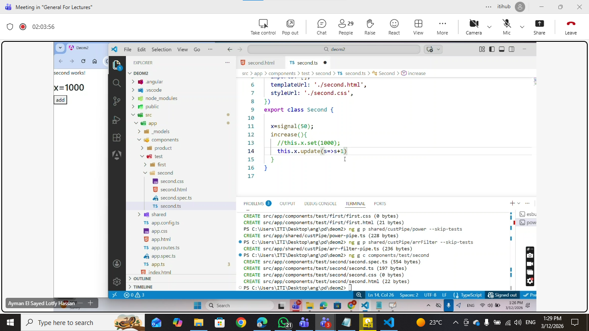
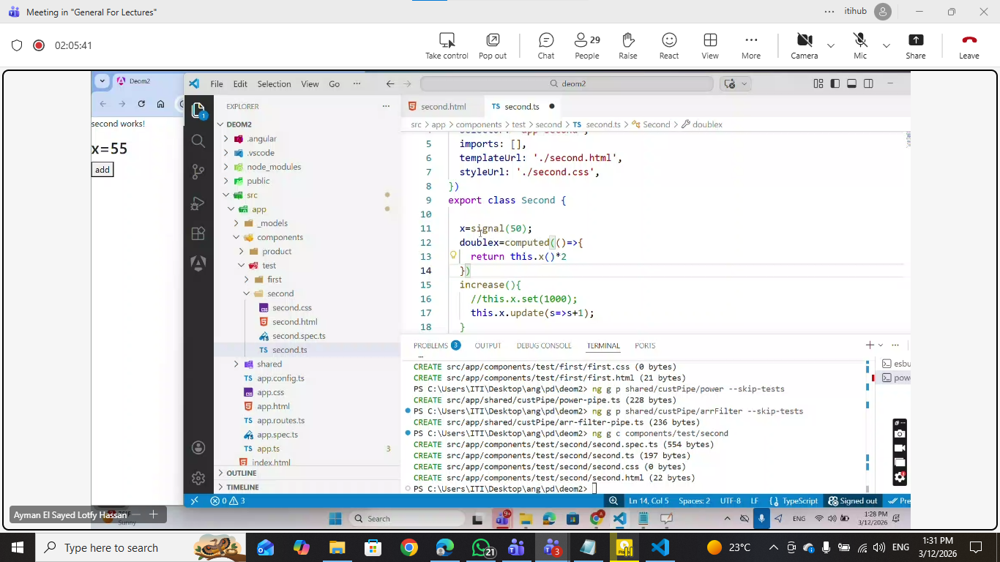
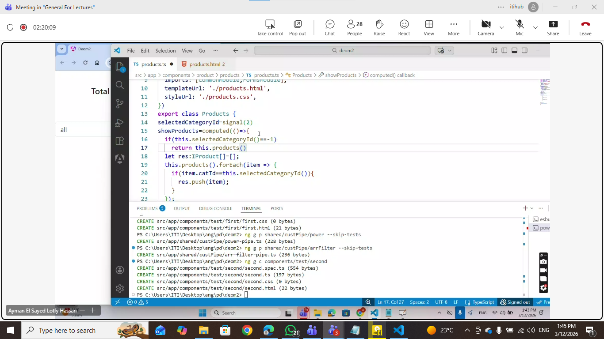
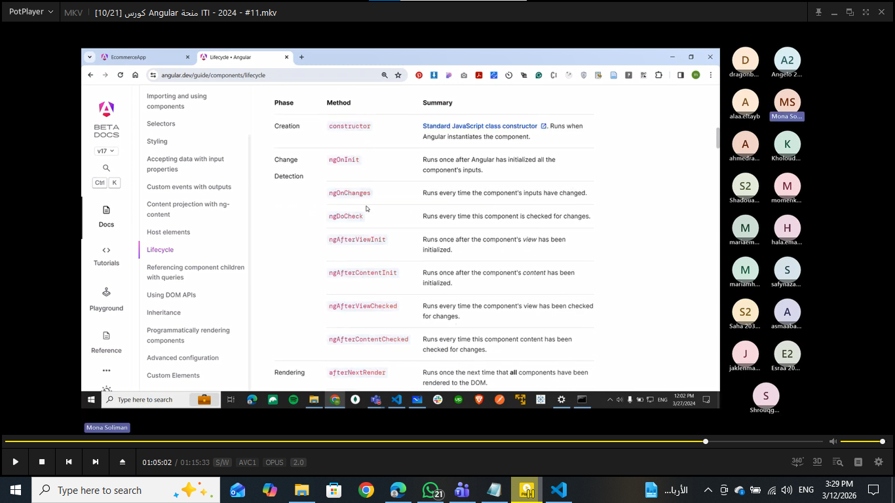

# Angular Demo Lectures — Lecture 03

A hands-on Angular demo project built during ITI front-end training. It covers **component interaction**, **custom pipes**, **custom directives**, **Angular signals**, and **component lifecycle hooks** using a **standalone** Angular 21 application styled with Bootstrap 5.

---

## 📚 Topics Covered

- **Component Interaction**
  - `@Input()` — passing data from parent to child component
  - `@Output()` & `EventEmitter` — emitting events from child to parent
  - `ngOnChanges` lifecycle hook — reacting to input property changes
- **Custom Pipes**
  - Creating a custom `SquarePipe` (`Math.pow`) with a configurable exponent parameter
  - Built-in pipes: `currency`, `date`
- **Custom Attribute Directives**
  - `HighlightCard` directive using `ElementRef`, `@Input()`, `@HostListener`
  - Mouse hover color switching (`mouseover` / `mouseout`)
  - Aliased directive selector input (`@Input('appHighlightCard')`)
- **Angular Signals**
  - `signal()` — reactive state primitive
  - `computed()` — derived signal values
  - `effect()` — side effects in response to signal changes
- **Component Lifecycle Hooks**
  - `ngOnChanges` — responds to `@Input` changes
  - Overview of Angular's full lifecycle sequence
- **Category Filtering via Parent–Child Architecture**
  - `Order` (parent) passes `selectedCatId` to `Products` (child) via `@Input`
  - `Products` emits `totalOrderPrice` back to `Order` via `@Output`
- **Template Syntax**
  - `@for` / `@empty` — new Angular control flow
  - `@switch` / `@case` / `@default` — stock status display
  - Template reference variables (`#countInput`) for DOM access
  - `currency` pipe for price formatting

---

## 🗂️ Project Structure

```
src/
├── app/
│   ├── Components/
│   │   ├── header/             ← app header
│   │   ├── footer/             ← app footer
│   │   ├── products/           ← product listing with cart logic (child)
│   │   └── order/              ← category filter + total price display (parent)
│   ├── Models/
│   │   ├── iproduct.ts         ← Iproduct interface (id, name, price, quantity, imgUrl, catId)
│   │   └── icategory.ts        ← Icategory interface (id, name)
│   ├── Pipes/
│   │   └── square-pipe.ts      ← custom SquarePipe (Math.pow with configurable exponent)
│   ├── directives/
│   │   └── highlight-card.ts   ← custom HighlightCard directive (hover color change)
│   ├── app.config.ts
│   ├── app.routes.ts
│   ├── app.html
│   └── app.ts
├── index.html
├── main.ts
└── styles.css
```

---

## 📸 Screenshots

| Signal | Computed Signal | Signal Effect |
|--------|----------------|--------------|
|  |  |  |

| Show Products (Computed) | Component Lifecycle |
|--------------------------|---------------------|
|  |  |

---

## 🚀 Getting Started

### Prerequisites

- Node.js & npm installed
- Angular CLI installed globally:

```bash
npm install -g @angular/cli
```

Verify installation:

```bash
ng -v
```

### Install Dependencies

```bash
npm install
```

### Run Development Server

```bash
ng serve
```

Open your browser to `http://localhost:4200/`. To open automatically:

```bash
ng serve --open
```

---

## 🛠️ Useful Angular CLI Commands

| Task | Command |
|------|---------|
| Create a new component | `ng g c ComponentName` |
| Create an interface | `ng g i models/InterfaceName` |
| Create a pipe | `ng g p pipes/PipeName` |
| Create a directive | `ng g d directives/DirectiveName` |
| Build for production | `ng build` |
| Run unit tests | `ng test` |

---

## 📦 Key Dependencies

| Package | Purpose |
|---------|---------|
| `@angular/core` ^21.2.0 | Angular framework, signals, lifecycle hooks |
| `@angular/forms` ^21.2.0 | `FormsModule` for `ngModel` |
| `@angular/common` ^21.2.0 | `CommonModule`, built-in pipes |
| `@angular/router` ^21.2.0 | Angular Router |
| `bootstrap` ^5.3.x | UI styling |
| `rxjs` ~7.8.0 | Reactive programming |
| `vitest` ^4.x | Unit testing |
| `prettier` ^3.x | Code formatting |

---

## 📝 Key Notes

- `@Input()` / `@Output()` enable one-directional data flow between parent and child components.
- `EventEmitter` must be initialized (`new EventEmitter()`) before being emitted.
- `ngOnChanges` fires whenever a bound `@Input()` property changes — ideal for re-filtering data.
- Custom pipes implement `PipeTransform` and must declare a `name` in the `@Pipe` decorator.
- Custom directives use `ElementRef` to access the host DOM element directly.
- `@HostListener` attaches DOM event listeners without touching the template.
- Signals (`signal()`, `computed()`, `effect()`) are Angular's modern reactive primitives, replacing manual change detection patterns.

---

## 🔗 Resources

- [Angular Documentation](https://angular.dev)
- [Angular CLI Reference](https://angular.dev/tools/cli)
- [Angular Template Syntax](https://angular.dev/guide/templates)
- [Angular Signals](https://angular.dev/guide/signals)
- [Angular Pipes](https://angular.dev/guide/templates/pipes)
- [Angular Directives](https://angular.dev/guide/directives)
- [Bootstrap 5 Docs](https://getbootstrap.com/docs/5.3)
